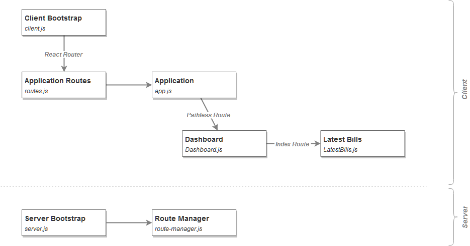

# Simple Application

> Other variants of the application, along with their short description are linked from
> [master](https://github.com/zen-js-code/react-universal-web-apps/) branch.

## Installation & Execution

The application is installed using:

```
npm install
```

and ran using:

```
npm start
```

You can access the application's server directly under http://localhost:6001 or via its BrowserSync access server http://localhost:3000. BrowserSync console is available under http://localhost:3001.

## Description

This incarnation of our application, as are those to follow, uses React and React Router to render its UI. The implementation is fairly standard.

**Schematically, it can be shown like this:**

