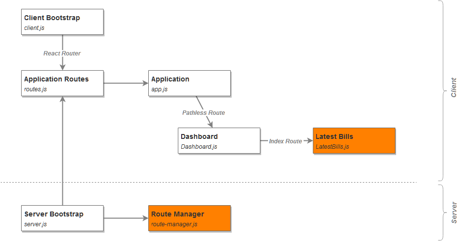

# Naive Universal Application

> Other variants of the application, along with their short description are linked from
> [master](https://github.com/zen-js-code/react-universal-web-apps/) branch.

## Installation & Execution

The application is installed using:

```
npm install
```

and ran using:

```
npm start
```

You can access the application's server directly under http://localhost:6001 or via its BrowserSync access server http://localhost:3000. BrowserSync console is available under http://localhost:3001.

## Description

The idea behind this version of the application is to:

1. render HTML on server, based on data necessary
2. deliver the HTML to the browser
3. send the data , used to render the HTML, to the browser as well
4. allow React to resolve the necessary re-renders
5. profit

**Structurally, it can be shown like this:**

