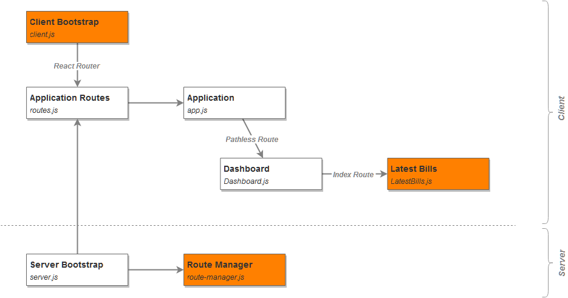

# A Little Less Naive Universal Application

> Other variants of the application, along with their short description are linked from
> [master](https://github.com/zen-js-code/react-universal-web-apps/tree/) branch.

## Installation & Execution

The application is installed using:

```
npm install
```

and ran using:

```
npm start
```

You can access the application's server directly under http://localhost:6001 or via its BrowserSync access server http://localhost:3000. BrowserSync console is available under http://localhost:3001.

## Description

This version makes use of a relatively new (and still experimental) feature of React - [Contexts](https://facebook.github.io/react/docs/context.html).

This feature allows you to pass data to components, from parent, without having to explicitly propagate it via props.

**Schematically, it can be shown like this:**

